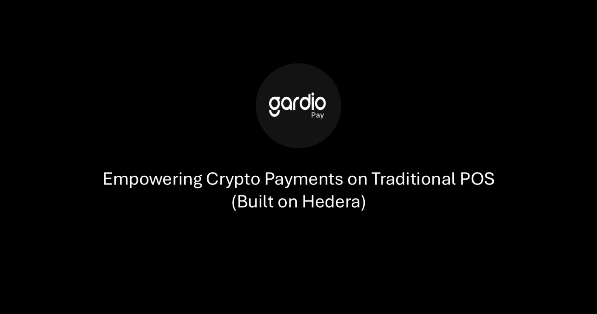

# gardio-gift

  

## Overview

Gardio Gift empowers seamless gift card and reward management across traditional Point of Sale (PoS) systems, built on Hedera and powered by the Gardio Gift Smartcard.

Our solution introduces a **single smartcard** capable of handling **multiple merchants’ gift balances and rewards**, seamlessly integrated with existing PoS terminals via the **Gardio Gift PoS app**.

Originally built on **Solana**, Gardio Gift was adapted and optimized for **Hedera** during the hackathon (**starting October 25**) to leverage Hedera’s high throughput, scalability, and low fees, enabling real-world, distributed ledger–powered rewards in everyday retail environments

---

## Project Description

**Gardio Gift** demonstrates a complete gift card and rewards management system powered by Hedera, featuring:  

- **Gardio Gift Smartcard** – A single EMV-compatible card that signs all transactions.  
- **PoS Terminal App** – Funds the card with gift balances and rewards; runs on traditional EMV PoS terminals.  
- **Gardio Gift Portals** – For merchants: set gift rules and promotions. For users: view balances, transactions, and transfer/share gift cards.  

Consumers can redeem or gift rewards at any participating merchant, while businesses can easily issue and manage digital gift balances through a unified backend.  

A **Card + PoS Simulator** was developed for the hackathon to replicate real-world retail interactions without physical hardware.

---

## System Components

1. **User Portal Frontend** – View balances, transactions, and transfer/share gift cards.  
2. **Gardio Gift Smartcard** – Secure EMV card that signs gift transactions.  
3. **PoS Application** – Merchant app for loading or redeeming gifts, works with standard terminals.  
4. **Backend Server** – Connects PoS, card, and Hedera network.  
5. **Smart Contract** – Verifies signatures, updates balances/rewards, and keeps on-chain records.  
6. **Gardio Simulator** – Testing tool for card–terminal interactions: composes EMV transactions, signs them on behalf of the card, and forwards to the backend for processing.

> **Note:** Merchant registration, card issuance, and terminal provisioning are performed offline as part of the setup process.

---

## Workflow Summary

1. **Merchant Setup (Offline)** – Register and provision PoS terminals  
2. **Card Issuance (Offline)** – Initialize Gardio Gift Smartcards and assign merchant access  
3. **Gift / Reward Flow (Demo)** –  
  - Merchant funds the user card with the gift balance and reward via **PoS terminal**.  
  - User redeems the gift via **PoS terminal**, using the card like a normal payment.  
  - **Gardio Smartcard** signs both fund and redeem transactions for processing by the smart contract.  
  - Users see updated balances instantly on their portals. 
4. **Portal Management** – Full visibility of gifts, rewards, and redemption history  
---

## Demo
  
**Watch the full demo on Vimeo:** [Gardio Gift Demo](https://vimeo.com/1132512934)

---
## Hackathon Deliverables

During the hackathon (starting October 25), the following updates were implemented:

- **Hedera Network Support** – Migrated from Solana; smart contracts rewritten in Solidity; frontend and backend updated for Hedera SDK and MetaMask.  
- **Card + PoS Simulator** – Enables full demo testing without physical hardware.

---

## Security

- **Private keys** remain securely stored on the Gardio Gift Smartcard  
- **All activity** (issuance, redemption, and balance updates) is verifiable on the Hedera public ledger  

---

## Upcoming Features

1. **Mobile App** – Mobile interface for managing gift cards, rewards, and balances  
2. **Transfer Gift Feature** – Ability to send or transfer gifts directly between users  
3. **Contactless Support** – Enhanced PoS experience using NFC-enabled Gardio Gift Smartcards  
4. **Merchant Portal** – Interface for merchants to set gift rules, issue rewards, and manage promotions. 

---

## Key Advantages

- **Smart, programmable gifts and rewards**  
- **Works with traditional PoS systems**  
- **Multi-merchant support on a single card**  
- **Secure, on-chain transparency (Hedera)**  
- **Familiar experience for both merchants and consumers**  

---

## Links

- Contact: **info@gardio.io**  
- Hackathon Submission: [View Gardio Gift on Hedera Africa Hackathon](https://dorahacks.io/buidl/35655)

---

## Source Code Access

The **Gardio Gift source code** can be shared **under a Non-Disclosure Agreement (NDA)** for evaluation or technical review.  
Please contact **info@gardio.io** to request access.  

The **Pitch Deck** and **Demo Guide** (including the Gardio Gift Portal, Simulator, and credentials) were provided via **Box links** during the hackathon submission.

---

© 2025 Gardio
