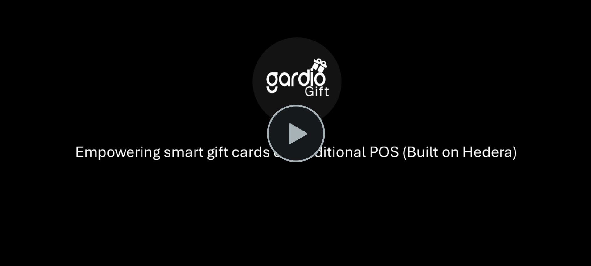

# gardio-gift

  

## Overview

**Gardio Gift** aims to empower **smart gifting and rewards** on traditional **Point of Sale (PoS)** systems — built on **Hedera** and powered by the **Gardio Gift Smartcard**.

Our solution introduces a **single smartcard** capable of handling **multiple merchants’ gift balances and rewards**, seamlessly integrated with existing PoS terminals via the **Gardio Gift PoS app**.

Originally built on **Solana**, Gardio Gift was **adapted and optimized for Hedera** during the hackathon (starting October 25) to leverage its high throughput, scalability, and low fees — enabling real-world use of blockchain-powered rewards in everyday retail environments.

---

## Demo
  
**Watch the full demo on Vimeo:** [Gardio Gift Demo](https://vimeo.com/1132512934)

---

## Project Description

**Gardio Gift** demonstrates a complete, real-world gifting and rewards ecosystem powered by blockchain, featuring:  
- **Gardio Gift Smartcard** – a single EMV-compatible card holding multiple merchants’ gifts and rewards  
- **PoS Terminal App** – processes redemptions and updates balances using existing retail PoS systems  
- **Gardio Gift Portal** – manages cards, merchants, and reward balances  

Consumers can redeem or gift rewards directly at any participating merchant, while businesses can easily issue and manage digital gift balances through a unified backend.  

A **Card + PoS Simulator** was developed for the hackathon to replicate real-world retail interactions without physical hardware.

---

## System Components

1. **Portal Frontend** – User interface for viewing transactions, balances, and transferring/sharing gift cards  
2. **Gardio Gift Smartcard** – Secure EMV-based card that stores multi-merchant gift and reward data  
3. **PoS Application** – Merchant-side app for redeeming or loading gifts, compatible with standard PoS systems  
4. **Backend Server** – Handles communication between the PoS, card, and blockchain (Hedera network)  
5. **Smart Contract** – Maintains on-chain records of gift issuance, redemption, and balance states  
6. **Gardio Simulator** – Demonstrates card–terminal interaction for demo purposes  

> **Note:** Merchant registration, card issuance, and terminal provisioning are performed offline as part of the setup process.

---

## Hackathon Deliverables

During the hackathon (starting October 25), the following were developed and delivered:
1. **Hedera Network Integration** – Smart contracts for reward and gift tracking  
2. **Card + PoS Simulator** – Enables full testing without hardware  
3. **Gardio Gift Portal** – Web-based interface for managing merchants, cards, and balances  

---

## Security

- **Private keys** remain securely stored on the Gardio Gift Smartcard  
- **All activity** (issuance, redemption, and balance updates) is verifiable on the Hedera public ledger  

---

## Workflow Summary

1. **Merchant Setup (Offline)** – Register and provision PoS terminals  
2. **Card Issuance (Offline)** – Initialize Gardio Gift Smartcards and assign merchant access  
3. **Gift / Reward Flow (Demo)** –  
   - Merchant issues or tops up a gift/reward via the **Gardio Gift Portal**  
   - Recipient redeems via **PoS terminal**  
   - The **Gardio Smartcard** validates and updates the transaction via the **Gardio Server**, recorded on **Hedera**  
   - Merchant and recipient view updated balances instantly  
4. **Portal Management** – Full visibility of gifts, rewards, and redemption history  

---

## Upcoming Features

1. **Mobile App** – Mobile interface for managing gift cards, rewards, and balances  
2. **Transfer Gift Feature** – Ability to send or transfer gifts directly between users  
3. **Contactless Support** – Enhanced PoS experience using NFC-enabled Gardio Gift Smartcards  
4. **Merchant Portal** – Merchant interface for managing gift balances and issuing rewards  

---

## Key Advantages

- **Smart, programmable gifts and rewards**  
- **Works with traditional PoS systems**  
- **Multi-merchant support on a single card**  
- **Secure, on-chain transparency (Hedera)**  
- **Familiar experience for both merchants and consumers**  

---

## Links

- Contact: **info@gardio.io**  
- Hackathon Submission: [View Gardio Gift on Hedera Africa Hackathon](https://dorahacks.io/buidl/35655)

---

## Source Code Access

The **Gardio Gift source code** can be shared **under a Non-Disclosure Agreement (NDA)** for evaluation or technical review.  
Please contact **info@gardio.io** to request access.  

The **Pitch Deck** and **Demo Guide** (including the Gardio Gift Portal, Simulator, and credentials) were provided via **Box links** during the hackathon submission.

---

© 2025 Gardio
